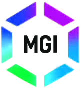

<picture>
  <source media="(prefers-color-scheme: dark)" srcset="assets/mgi-logo.webp">
  
</picture>

<h1>Mad God</h1>

<b>I build software that runs on my own hardware, and I keep it running myself.</b>

Kazakhstan · two servers in the next room · nine things live right now

  
  
  
  

---

## How I got here

I started taking laptops apart in the fourth grade, and everything I have done
since has been about hardware one way or another. At sixteen I trained as an
electrician, then spent years on industrial sites: automation, low voltage
systems, networks, construction.

From there I moved into AI, and I came at it from the engineering and hardware
side rather than from prompts. I ran models on my own machines, fine tuned them
and measured what held up. Linux came with that, then Rust, then my own
programs, sites and bots.

Nine of them are live right now, and almost all are open source.

## What I build

| Project | What it does | Stack |
| --- | --- | --- |
| **[mgi-mind](https://github.com/madgodinc/mgi-mind)** | Long term memory for AI assistants, running locally. Hybrid search with reranking, spoken over MCP. | Rust, Qdrant, ONNX |
| **[mgi-pulse](https://github.com/madgodinc/mgi-pulse)** | Terminal log viewer. 11 formats with auto detect, a query DSL, native `--follow`, timeline scrub. 2 GB parsed in 2.8 s. | Rust |
| **[crescendo](https://github.com/madgodinc/crescendo)** | Five agents with separated roles: the one who writes does not review itself, the one who deploys does not decide what ships. Every step lands in a SHA-256 hash chain. | Python |
| **[RITM](https://github.com/madgodinc/mgi-game-ritm)** | Browser rhythm game. Two play modes over one Web Audio engine, timed against the sound card rather than the frame, plus a Python generator that turns your own music into charts. | TypeScript, Canvas, librosa |
| **[mgi-stream](https://github.com/madgodinc/mgi-stream)** | Reads a TikTok LIVE chat aloud into the broadcast. Self hosted, no API key, no TikTok login. | Electron |
| **[aurora-cli](https://github.com/madgodinc/aurora-cli)** | Terminal client for Aurora. | Go |
| **[aurora-project](https://github.com/madgodinc/aurora-project)** | Manifesto and whitepaper on persistent, self modifying AI entities. EN and RU. | Writing |
| **[Schematica](https://madgodinc.net/schematica.html)** | Draw a page skeleton, get back a description a model can act on. One HTML file, no build, works offline. | HTML, 123 KB |

**Live, not on GitHub**

- **[Aurora](https://madgodinc.net)** answers from my own server instead of a cloud API, keeps a
  separate memory per person, and bills real GPU seconds instead of message count.
  You can [run the checks yourself](https://madgodinc.net/check.html) against the running system.
- **[CreepiDota](https://creepidota.com)** finds teammates and reviews played Dota matches against
  your own baseline on that hero. A site, a Telegram bot and a Windows app on one account.
  The hero database is 1.2 M records from 120 000+ leaderboard matches over 100 straight weeks.
- **[Planet Mutant](https://planet-mutant.net)** is steampunk survival in the browser. Eleven crafting
  actions, no recipe list on screen, 1.6 MB for the whole build, plays offline from a phone.

## Working with AI

Two sides of it, and I do both.

**As a tool.** Claude is my daily working pair, mostly Claude Code. The part I
care about is what sits outside the model: persistent memory, written skills and
working protocols, so that a session starts from what was already decided rather
than from a blank page. [mgi-mind](https://github.com/madgodinc/mgi-mind) came
out of exactly that problem and now holds tens of thousands of entries.

**As the subject.** Two servers of my own, 256 GB of RAM and 64 GB of VRAM
between them, running llama.cpp. That is production, not a lab bench: it serves
Aurora and CreepiDota's screenshot reading. Around it I pull open models apart
and measure what a change actually costs: quantisation, KV cache placement,
context stretching, distills and fine tuning. Qwen, Gemma, DeepSeek and
gpt-oss-120b have all been through that, along with a pile of smaller ones.
Every number on this page was measured on my own machines.

The same hardware generates music: ACE-Step 1.5 (a diffusion transformer plus a
1.7B language model, 9.4 GB of weights) and HeartMuLa-oss-3B with HeartCodec.
Ninety seconds of audio takes about forty three seconds. Neither ran out of the
box: Pascal cards have no bfloat16, so both needed patching down to fp16, and
ACE-Step's two halves are split across the two GPUs to fit. A hundred tracks for
my own rhythm game came out of that.

Why local at all. Kazakhstan's personal data law makes cloud inference awkward
for client work, and a model on your own hardware does not change its price,
its terms or its weights overnight.

## Stack

**Languages**

**AI on my own machines**

**Front**

**Back and ops**

## Where everything lives

| | |
| --- | --- |
| Portfolio and Aurora | [madgodinc.net](https://madgodinc.net) |
| Check Aurora's claims yourself | [madgodinc.net/check.html](https://madgodinc.net/check.html) |
| API reference | [madgodinc.net/api.md](https://madgodinc.net/api.md) |
| If you are an AI agent | [llms.txt](https://madgodinc.net/llms.txt) · [ai.md](https://madgodinc.net/ai.md) |
| Schematica, in the browser | [madgodinc.net/schematica.html](https://madgodinc.net/schematica.html) |
| CreepiDota | [creepidota.com](https://creepidota.com) · [@creepidota_bot](https://t.me/creepidota_bot) · [Windows build](https://creepidota.com/assets/desktop/CreepiDotaSetup.exe) |
| Planet Mutant | [planet-mutant.net](https://planet-mutant.net) |
| Crescendo, live dashboard | [crescendo-dashboard.pages.dev](https://crescendo-dashboard.pages.dev) |
| Telegram | [@madgodinc](https://t.me/madgodinc) |
| Email | [mad.god.inc@gmail.com](mailto:mad.god.inc@gmail.com) |

## Open for work

I take outside work and carry it myself, from the first conversation to the
server it runs on: sites, Telegram bots, desktop programs, self hosted AI, and
automation of whatever you are doing by hand today. Remote, with travel for
installation or signing.

Write to [Telegram](https://t.me/madgodinc), or leave a request at
[madgodinc.net](https://madgodinc.net).
